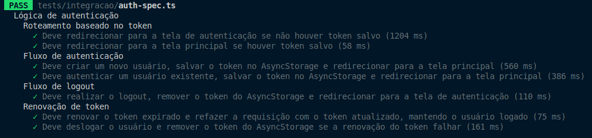

<p align="center" >
  <a href="" target="blank"></a>
</p>

<p>
    <p align="center">Jogo de Damas online multiplataforma em desenvolvimento</p>
</p>

## Descrição

**DamasPaia Mobile** é o frontend mobile de um jogo de damas online, integrado a um backend em NestJS e uma futura interface web. Desenvolvido com React Native, Unistyles 2.0 e TypeScript, oferece uma interface nativa e moderna.

| Plataforma                                                   | Tecnologia   | Status       |
| ------------------------------------------------------------ | ------------ | ------------ |
| [Backend](https://github.com/6aleatorio6/Damas-Paia_backend) | NestJS       | Em andamento |
| [Mobile](https://github.com/6aleatorio6/Damas-Paia_mobile)   | React Native | Em andamento |
| Web                                                          | React        | Não iniciado |
| Desktop                                                      | Não definido | Não iniciado |

## Funcionalidades do Mobile

- **Cadastro e Edição de Conta**

  - Cadastro e login de usuários com proteção de rotas utilizando React Context.
  - Edição de perfil, incluindo alterações de nome e senha, além da opção de exclusão de conta.

- **Comunicação com Backend**

  - Revalidação automática de tokens para segurança contínua da sessão e gerenciamento do estado global de autenticação.
  - Integrações para operações de cadastro, login e autenticação.
  - Gerenciamento de estado e cache com React Query e hooks personalizados.
  - Comunicação em tempo real utilizando Socket.io, com proteção via token.

- **Partida de Damas**

  - **HUD do Jogador**

    - Exibição dinâmica do contador de peças e do estado de turno atual.
    - Destaque visual para o jogador ativo, sincronizado com o estado da partida.

  - **Tabuleiro**
    - Tabuleiro 8x8 com rotação automática para manter o jogador na parte inferior da tela.
    - Movimentação, captura e promoção de peças gerenciadas em tempo real via Socket.io.
    - Animações suaves e sequenciais para movimentação, promoção e captura de peças, utilizando a API Animated.

- **Pareamento de Jogadores**

  - Modal de espera com opção de cancelar a busca por oponente.
  - Saída do modal desconecta automaticamente o jogador da fila de pareamento.
  - Redirecionamento automático para a tela da partida assim que um oponente é encontrado.

- **Validações de Formulários**
  - Biblioteca flexível para validação de formulários, com suporte a validações responsivas e adaptáveis.
  - Todos os formulários incluem validações configuráveis para garantir a integridade dos dados.

## Instalação

1. Clone o repositório:

   ```bash
   git clone https://github.com/6aleatorio6/Damas-Paia_mobile.git
   ```

2. Acesse o diretório do projeto:

   ```bash
   cd Damas-Paia_mobile
   ```

3. Crie um arquivo `.env` usando o `.env.example` como base:

   ```bash
   cp .env.example .env
   ```

4. Instale as dependencias:

   ```bash
   npm install
   ```

5. Instale o emulador e o JDK:

   Use script `installEmu.sh` para instalar automaticamente o JDK e o emulador Android, funcionando apenas em sistemas Debian/Ubuntu.

   ```bash
   chmod +x ./installEmu.sh && ./installEmu.sh
   ```

## Executando a Aplicação

Devido ao uso do **Unistyles**, o Expo funciona apenas em modo `development build`.

- Se instalou o emulador pelo script `installEmu.sh`, você pode usar o comando abaixo para desenvolver pelo emulador Android:

  ```bash
  npm run android
  ```

## Testes de integração

Para executar os testes de integração, utilize o comando abaixo:

```bash
npm run test
```

### Resultados dos Testes

Abaixo está uma captura de tela dos testes do projeto:



## Criador

- **Autor:** Leonardo L. Felix
  - **Email:** [leonardolfelix12@gmail.com](mailto:leonardolfelix12@gmail.com)
  - **GitHub:** [6aleatorio6](https://www.github.com/6aleatorio6)
